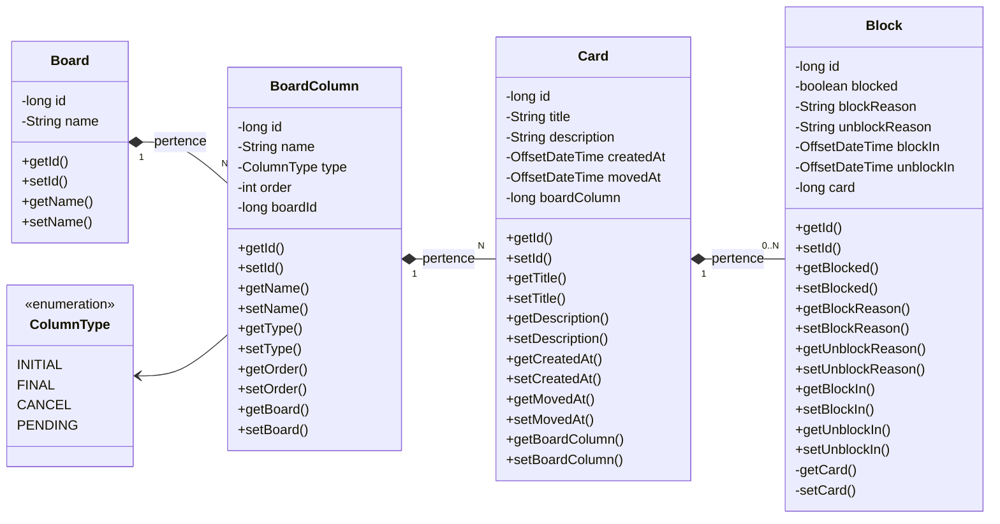

# Board Challenge - Santander DIO Bootcamp Java

## 📋 Sobre o Projeto

Sistema de gerenciamento de boards estilo Kanban desenvolvido em Java, permitindo criar e gerenciar boards, colunas e cards com funcionalidades de bloqueio e movimentação entre colunas.

## ⚡ Funcionalidades

- **Gerenciamento de Boards**: Criar, selecionar e excluir boards
- **Gerenciamento de Cards**: Criar, mover, visualizar cards
- **Sistema de Bloqueio**: Bloquear e desbloquear cards com motivos
- **Colunas Personalizadas**: Suporte a diferentes tipos de colunas (INITIAL, PENDING, FINAL, CANCEL)
- **Interface Console**: Menu interativo via linha de comando
- **Persistência**: Banco de dados MySQL com migrações Liquibase

## 🛠️ Tecnologias Utilizadas

- **Java 17+**: Linguagem principal
- **MySQL 8.0**: Banco de dados
- **Liquibase 4.29.1**: Controle de versão do banco de dados
- **Lombok 1.18.34**: Redução de código boilerplate
- **Gradle**: Gerenciamento de dependências e build
- **JDBC**: Conectividade com banco de dados

## 🏗️ Arquitetura

O projeto segue uma arquitetura em camadas:

- **UI (User Interface)**: Menus interativos (`MainMenu`, `BoardMenu`)
- **Service**: Lógica de negócio (`BoardService`, `CardService`, etc.)
- **DAO (Data Access Object)**: Acesso aos dados
- **Entity**: Entidades do banco de dados
- **DTO**: Objetos de transferência de dados
- **Migration**: Scripts de migração do banco

## 📊 Diagrama de classes



## 🗄️ Estrutura do Banco de Dados

### Tabelas Principais

- **BOARDS**: Armazena informações dos boards
- **BOARDS_COLUMNS**: Colunas de cada board com tipos e ordem
- **CARDS**: Cards com título, descrição e posicionamento
- **BLOCKS**: Sistema de bloqueio de cards com motivos

### Relacionamentos

- Um Board possui múltiplas Colunas
- Uma Coluna possui múltiplos Cards
- Um Card pode ter múltiplos Bloqueios (histórico)

## 🚀 Como Executar

### Pré-requisitos

- Java 17 ou superior
- MySQL 8.0
- Gradle (incluído wrapper)

### Configuração do Banco

1. Crie um banco de dados MySQL:
```sql
CREATE DATABASE board;
```

2. Configure as credenciais em `src/main/resources/liquibase.properties`:
```properties
changeLogFile=db.changelog/db.changelog-master.yml
url=jdbc:mysql://localhost:3306/board
username=seu_usuario
password=sua_senha
driver=com.mysql.cj.jdbc.Driver
```

### Execução

1. Clone o repositório
2. Execute o projeto:
```bash
./gradlew run
```

Ou compile e execute:
```bash
./gradlew build
java -jar build/libs/Board-1.0-SNAPSHOT.jar
```

## 📱 Como Usar

### Menu Principal
1. **Criar um novo board**: Cria um board com colunas padrão
2. **Selecionar board existente**: Acessa um board específico
3. **Excluir um board**: Remove um board e todos seus dados
4. **Sair**: Encerra o programa

### Menu do Board
1. **Criar um card**: Adiciona novo card na coluna inicial
2. **Mover um card**: Move card para próxima coluna
3. **Bloquear um card**: Bloqueia card com motivo
4. **Desbloquear um card**: Remove bloqueio de card
5. **Cancelar um card**: Move card para coluna de cancelamento
6. **Visualizar board**: Mostra estrutura completa do board
7. **Visualizar coluna com cards**: Lista cards de uma coluna
8. **Visualizar card**: Detalhes completos de um card

## 🔧 Estrutura de Arquivos

```
src/
├── main/
│   ├── java/me/dio/
│   │   ├── Main.java                 # Classe principal
│   │   ├── dto/                      # Data Transfer Objects
│   │   ├── exception/                # Exceções personalizadas
│   │   ├── persistence/              # Camada de persistência
│   │   │   ├── config/              # Configuração de conexão
│   │   │   ├── dao/                 # Data Access Objects
│   │   │   ├── entity/              # Entidades do banco
│   │   │   └── migration/           # Estratégia de migração
│   │   ├── service/                 # Lógica de negócio
│   │   └── ui/                      # Interface do usuário
│   └── resources/
│       ├── liquibase.properties     # Config Liquibase
│       └── db.changelog/            # Scripts de migração
└── test/                            # Testes (estrutura)
```

## 📝 Controle de Versão do Banco

O projeto utiliza Liquibase para versionamento do banco de dados:

- **Migrations**: Localizadas em `src/main/resources/db.changelog/migrations/`
- **Master File**: `db.changelog-master.yml` inclui todas as migrações
- **Execução Automática**: Migrações executam automaticamente na inicialização

## 🔍 Padrões Utilizados

- **DAO Pattern**: Separação da lógica de acesso a dados
- **DTO Pattern**: Transferência de dados entre camadas
- **Strategy Pattern**: Implementado na migração do banco
- **Menu Pattern**: Interface organizada em menus hierárquicos

## 🎯 Desafios Implementados

Este projeto foi desenvolvido como parte do Bootcamp Santander DIO, implementando:

- ✅ Sistema completo de gerenciamento de boards
- ✅ Persistência em banco de dados relacional
- ✅ Controle de versionamento de schema
- ✅ Interface interativa via console
- ✅ Arquitetura em camadas bem definida
- ✅ Tratamento de exceções personalizadas

## 👨‍💻 Autor

Desenvolvido durante o Bootcamp Java Santander DIO
