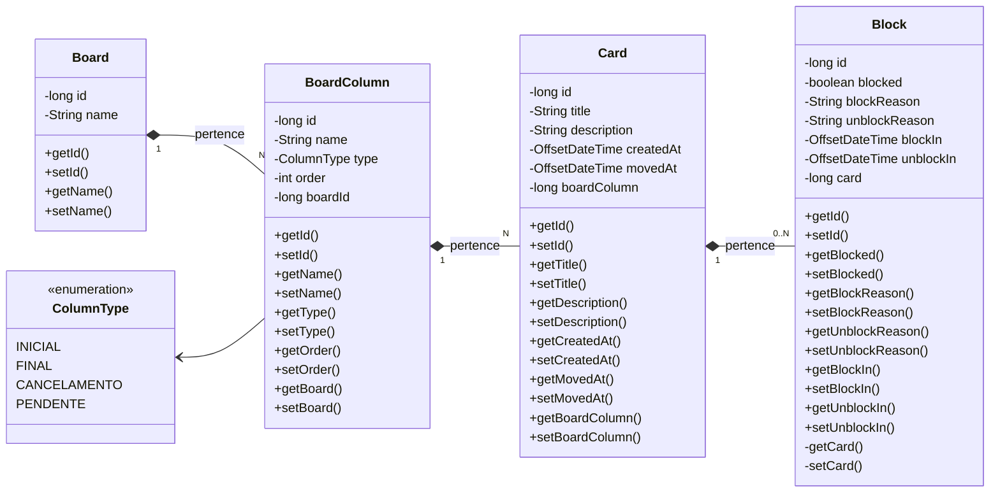

# Board Challenge - Santander DIO Bootcamp Java

## Diagrama de classes

```mermaid
classDiagram
direction RL

class Board {
  -long id
  -String name
  +getId()
  +setId()
  +getName()
  +setName()
}

class BoardColumn {
  -long id
  -String name
  -ColumnType type
  -int order
  -long boardId
  +getId()
  +setId()
  +getName()
  +setName()
  +getType()
  +setType()
  +getOrder()
  +setOrder()
  +getBoard()
  +setBoard()
}

class Card {
  -long id
  -String title
  -String description
  -OffsetDateTime createdAt
  -OffsetDateTime movedAt
  -long boardColumn
  +getId()
  +setId()
  +getTitle()
  +setTitle()
  +getDescription()
  +setDescription()
  +getCreatedAt()
  +setCreatedAt()
  +getMovedAt()
  +setMovedAt()
  +getBoardColumn()
  +setBoardColumn()
}

class Block {
  -long id
  -boolean blocked
  -String blockReason
  -String unblockReason
  -OffsetDateTime blockIn
  -OffsetDateTime unblockIn
  -long card
  +getId()
  +setId()
  +getBlocked()
  +setBlocked()
  +getBlockReason()
  +setBlockReason()
  +getUnblockReason()
  +setUnblockReason()
  +getBlockIn()
  +setBlockIn()
  +getUnblockIn()
  +setUnblockIn()
  -getCard()
  -setCard()
}

class ColumnType {
  <<enumeration>>
  INICIAL
  FINAL
  CANCELAMENTO
  PENDENTE
}

BoardColumn "N" --* "1" Board : pertence
Card "N" --* "1" BoardColumn : pertence
Block "0..N" --* "1" Card : pertence
BoardColumn --> ColumnType
```
